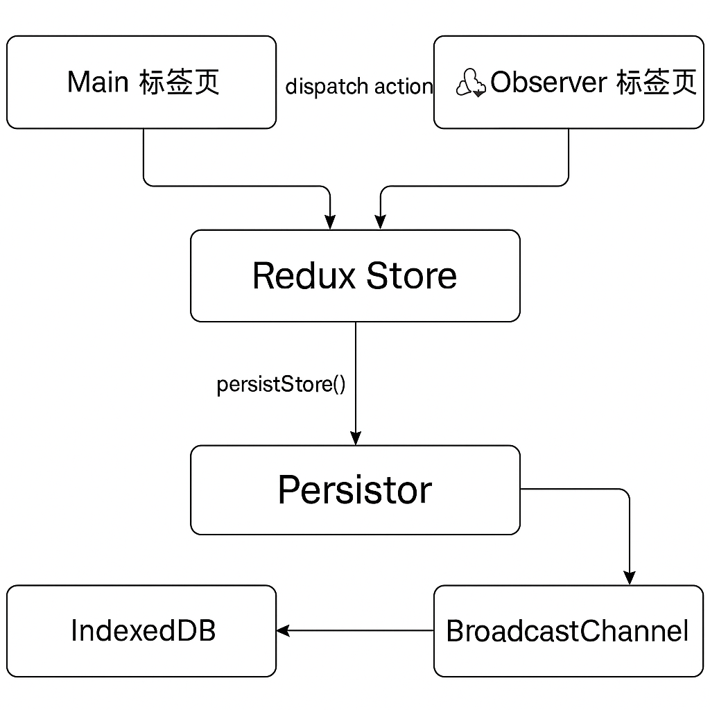

# StateKeeper

> 多标签页、可持久化、实时同步的前端状态管理范式。

## 🌐 项目简介

StateKeeper 是一个以 Redux 为核心，融合 IndexedDB 持久化和 BroadcastChannel 实时通信的前端状态架构 demo。

- ✅ 支持刷新后状态不丢失
- ✅ 多标签页状态同步
- ✅ 使用 Redux Persist + IndexedDB
- ✅ 使用 BroadcastChannel 进行跨标签页广播

## 📦 技术栈

- Next.js (App Router)
- Redux Toolkit
- Redux Persist
- IndexedDB（通过 `@piotr-cz/redux-persist-idb-storage`）
- BroadcastChannel（原生 API）
- Tailwind CSS

## 📸 架构图

 

## 🚀 页面说明

- `/` 主页面：任务添加、切换、删除，广播同步状态变更
- `/observer` 观察页：实时接收其他标签页广播，展示任务统计和状态同步

## 📡 状态同步机制

1. 任意标签页添加 / 删除 / 切换任务
2. 状态更新 → IndexedDB 持久化 + BroadcastChannel 发出变更消息
3. 其他标签页接收 Broadcast 消息 → 触发 Redux 同步
4. 所有标签页保持状态一致

## 📂 目录结构

```
src/
├── app/
│   ├── page.tsx          // 主页面
│   └── observer/
│       └── page.tsx      // Observer 页面（展示任务列表和同步状态）
├── components/
│   ├── AddTaskForm.tsx   // 添加任务表单
│   ├── TaskList.tsx      // 任务列表组件
│   ├── TaskStats.tsx     // 任务统计组件
│   └── BroadcastListener.tsx  // 监听其他标签页广播同步的组件
├── features/
│   └── tasksSlice.ts     // Redux Slice，管理任务列表状态
├── store/
│   └── index.ts          // Redux Store 配置和 persistStore 配置
├── utils/
│   └── broadcast.ts      // BroadcastChannel 配置与实例
└── styles/
    └── globals.css       // 样式文件

```

## 🧠 背后理念

请参考博客：
- [StateKeeper：一个状态不会消失的前端小系统](https://huxiaoyue111111s-organization.gitbook.io/frontend-tips/statekeeper-yi-ge-zhuang-tai-bu-hui-xiao-shi-de-qian-duan-xiao-xi-tong)
- [仓库管理员的秘密：persistor 是如何守住状态的？](https://huxiaoyue111111s-organization.gitbook.io/frontend-tips/cang-ku-guan-li-yuan-de-mi-mi-persistor-shi-ru-he-shou-zhu-zhuang-tai-de)
- [状态广播术：如何让多个标签页同步数据？](https://huxiaoyue111111s-organization.gitbook.io/frontend-tips/zhuang-tai-guang-bo-shu-ru-he-rang-duo-ge-biao-qian-ye-tong-bu-shu-ju)
- [系统感知与状态的远见](https://huxiaoyue111111s-organization.gitbook.io/frontend-tips/xi-tong-gan-zhi-yu-zhuang-tai-de-yuan-jian)

> StateKeeper 并不是为了“刷新后不丢数据”这个功能点而设计，而是为了解决现代前端系统中的“状态无法被感知、共享、广播”的结构性问题。

---

## ✨ 启动方法

```bash
npm install
npm run dev
```
访问：`http://localhost:3000` 和 `http://localhost:3000/observer`

---

## 📬 作者

by Taylor

